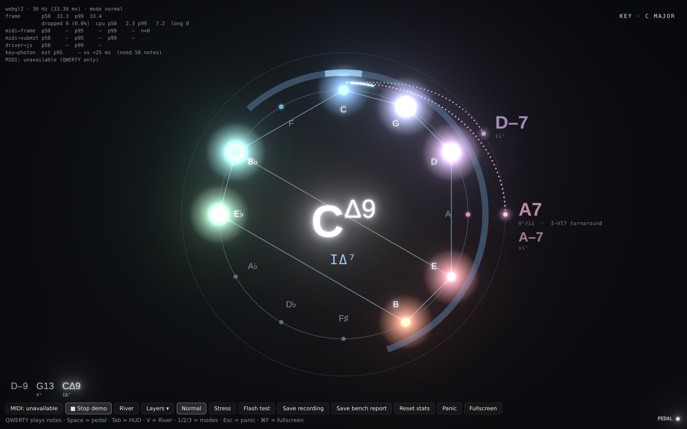

# Compass-first: design review

*2026-10-01. Jeff played the spike and gave this feedback: the Compass is the thing, and the River on the left is generic piano roll that never shows chord names. So:*

- *Make the Compass alone, centered and larger, the default.*
- *Keep the River available.*
- *Flesh out the predictions around the edge of the Compass.*
- *Let each layer be switched on and off.*

The feedback went to two reviewers: a visual and motion designer, and a jazz theorist. Below is what they recommended and what this PR did with it.

## Layout (designer)

| Recommendation | Status |
|---|---|
| Center the Compass at 0.5 h with R = min(0.29 h, 0.24 w), about 2.1× bigger | Done (`COMPASS_ONLY_*` in tuning.ts) |
| Set radii in multiples of R: pitch names 0.84, needle 1.06, key arc 1.14, prediction orbit 1.30, labels from 1.40 | Done |
| Move the key name to a corner | Done (top right, because the HUD is top left) |
| Add a lead-sheet line of the last 6 chords with roman numerals, bottom left | Done (the "Chord history" layer). This fixes "chord names don't show". |
| Scale hairlines with R, set polygon alpha to 0.20, auto-fit long chord names | Done |
| Calm the tritone shimmer (it flickered at 2.9 Hz) | Done: 0.3 ± 0.1 at 1.2 Hz |
| Add idle breathing after 6 s | Done (ring and key arc) |
| Show a trail of the last 3 roots on the needle track | Done |
| Avoid: right-hand sparks around the ring, ghost polygons, labels that ride the needle spring | Not done, on purpose |

## Predictions (designer and theorist)

| Recommendation | Status |
|---|---|
| Show satellites on a faint orbit at 1.30 R, sized by probability | Done |
| Show large labels outside the orbit in the root's hue, sized and faded by probability, with no percentages | Done |
| Show the roman numeral under each prediction, the reason only on the top one, and "→ A♭" when the chord would modulate | Done |
| Route ghost arcs outside the ring (a spiral from 1.06 to 1.30 R), with a slow pulse every 2.4 s | Done |
| Add a second step: the chord after next, chained off the top prediction and dimmer | Done (`Prediction.then`) |
| Handle crowding: a second label on the same root stacks beside the first, and a third collision merges ("C7 · C–7") | Done |
| Mark landings, never with a "wrong" signal: see the breakdown below | Done (`Analysis.landing`) |
| Show a badge for named moments: ii–V–I, turnaround, backdoor, tritone sub!, modal interchange | Done |
| Keep predictions up through a silence, since the gap is when "what's next" matters | Done |
| Scale the label to 1.12× on a landing | Not done. The comet, ripple and badge already mark it. |

How each kind of landing is marked:

- **Exact hit:** the arc fills in like a comet, plus a ripple sized by function (the tonic gets the biggest).
- **Right root, different quality:** half a ripple.
- **A surprise:** one slow shimmer.

## Prediction rules (theorist)

**Fixed**

- Secondary dominants now resolve to the diatonic quality: A7 goes to D–7 in C, not DΔ7.
- Landings now match on chord family, not just root.
- Dropped "ø7 as iv–6 color".
- Dropped the same-root rules that could never land: sus → 7 and I → I7.

**Added**

- A ii–V completion boost, and "ii–V chain".
- Turnaround: VI7 or vi → ii → V.
- Dominant cycle, as in the rhythm-changes bridge.
- Blues I7 ↔ IV7, with ♯iv°. A lone IV7 keeps its V–I reading, and a ii–V into it always resolves.
- Minor ii–V–i, and i → V.
- Tritone ii–V.
- Minor-key ♭VI → iiø and ♭VI → V.
- Extra weight back to ii and VI7 right after a ii–V–I.

Each prediction now carries `q`, `roman` (V⁷/ii for secondary dominants), `fn` (T/SD/D) and `kind`. Tests are in `packages/theory/test/predict.test.ts`.

**Deferred:** reading dim7 as a rootless 7♭9 (rule 9).

**Known wrinkle:** when the key reads as a mode (for example D dorian on a held D–7), the numeral in the center follows the mode, but the prediction numerals follow the functional key.

## Controls

- **V** or the **River** button brings the River back beside the Compass. The choice is remembered between launches.
- **Layers ▾** switches each part on or off: Notes, Chord shape, Tritones, Root needle, Key, Chord name, Predictions, Chord history. The choices are remembered.
