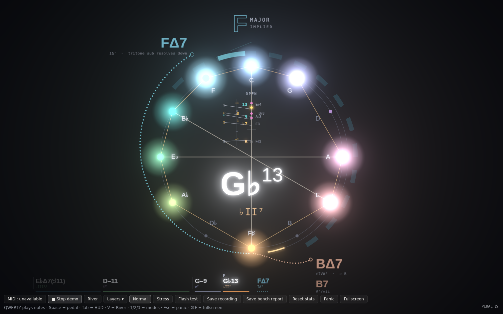
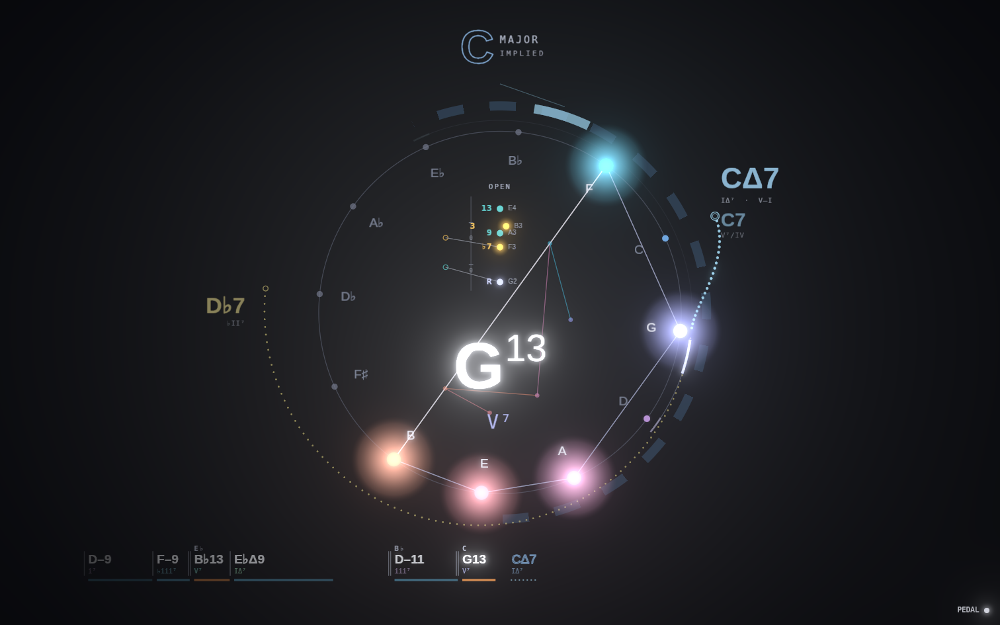

# Compass, round two: dream big

*2026-10-01. Jeff played the compass-only view (PR #2) and sent five notes:*

1. *The chord history sticks to the left and never comes further. Why?*
2. *The key should be much more prominent. It reads well above the compass when the River is visible but gets lost full screen.*
3. *Hide the outermost ring. Separate what is played from what is theoretical, implied or predicted, and build a taxonomy for that through information design.*
4. *Show frequency and range somewhere other than the piano roll. Pianists care about voicings.*
5. *Dream big and try things.*

The notes went to the same team as round one: a visual and motion designer, a jazz theorist and a working pianist. Everything below is built and switchable in the Layers menu, so each idea can be judged by playing it.

## 1. Why the history was stuck

It was a fixed box: it started 24 px from the left edge, was capped at 42% of the width, and held the last 6 chords oldest-first. New chords pushed old ones out of the box instead of moving anything across the screen.

**Now: the lead sheet** (layer "Lead sheet"). It is a full-width strip along the bottom, with "now" under the center of the compass.

- The current chord sits just left of center, bright.
- Past chords scroll left at a steady rate, so the space between chords is time. A long-held chord takes more room, and a silence leaves a gap.
- Each chord has a duration bar under it, colored by function: tonic blue, subdominant green, dominant amber.
- A key change gets a double barline and the new key's name.
- Right of center, in outline with a dotted underline, are the top prediction and the chord after it. The future is drawn in the predicted style (see the taxonomy below).
- Old chords fade as they approach the left edge.

## 2. The key as a hero title

Layer: "Key".

- In the compass view, the key is a large title above the ring, about 0.26 R: the tonic letter in the display face, tinted with its hue, and the mode in small caps to its upper right.
- An implied key (a ii–V pointing somewhere the music has not landed) is drawn **hollow**, with the word IMPLIED under the mode.
- A hairline tether runs from the tonic tick on the key arc up to the title when the tick is near the top. The tick widens for a moment on a key change.
- Prediction labels treat the title as an obstacle and keep clear of it.

**Tonic at top** (layer "Tonic at top", off by default): the whole wheel turns so the key's tonic is at 12 o'clock. Roman numerals then sit in fixed places, so V is always one step clockwise, IV one step counterclockwise, and a ii–V–I always looks the same shape. The wheel turns only for a confirmed key, on a soft spring, and prediction labels hide while it turns. It is off by default because it moves the letter names. It is worth trying for a session to see whether functional positions beat absolute ones.

## 3. The taxonomy: ink = certainty

The team settled on five tiers. Each tier has one visual grammar, so you can tell what kind of thing a mark is before reading it.

| Tier | What | How it is drawn | Where |
|---|---|---|---|
| **Played** | Sounding now | Solid fill and glow. The only tier allowed to bloom. | Inside the ring, the current chord name, the current lead-sheet entry |
| **Heard** | The recent past | Solid but grey, with no glow, drifting away | Needle trail, past lead-sheet entries, the voice-leading ghost |
| **Structure** | Key, numerals, function | Tinted bands, hairlines, mono caps | Key arc and title, roman numerals, function bars |
| **Implied** | Inferred root, implied key | The confirmed form, but hollow: outline text, dashed strokes | Where its confirmed form would be |
| **Predicted** | The future | Dotted or hollow only, kept under the bloom threshold | Outside the ring, 1.25 R and beyond; right of now on the lead sheet |

Changes that follow from it:

- **The outermost ring (the prediction orbit) is gone.** Predictions now float in empty space, which reads as "not here yet".
- Prediction satellites are hollow rings with no glow. They used to be solid discs with glow, which made a guess look as solid as a played note.
- The main ring is dimmer (0.10). Unlit pitch dots are dimmer too.
- The needle trail is grey ("heard") instead of glowing in the root's hue.
- The inferred root of a rootless voicing is a dashed circle (implied), not a solid ring.
- An implied key arc is dashed and dimmer. An implied key title is outline text.
- The key title sits just under the bloom threshold, so structure never glows like a played note.

## 4. Voicings, not a piano roll

Three ideas, from the most concrete to the most abstract.

### Voicing stack (on by default)

Layer: "Voicing stack". A vertical ladder inside the top of the ring. Each held note is a disc at its pitch, so the spacing is the voicing.

- **Discs are colored by role, not by pitch class.** Guide tones (3 and 7) are gold and glow. Tensions (9, 11, 13) are teal. Altered tensions (♭9, ♯9, ♯11, ♭13) are magenta. Fifths are grey. The root is in its own hue. A note outside the chord is a hollow grey ring.
- Each disc shows its function on the left (R, 3, ♭7, 9, ♯11) and its note name and octave on the right.
- Notes a second apart sit side by side, as on a staff.
- Left-hand discs are slightly larger. A short line marks the split between the hands.
- An inferred root shows as a dashed circle below the bass.
- **A name for the voicing** sits at the top, for example: shell 1-7-3, rootless A, rootless B, UST ♭VI, So What, quartal, drop 2, drop 3, cluster, close, open. This comes from the new `analyzeVoicing` in `packages/theory/src/voicing.ts`, which has 11 tests.
- **Voice leading.** On a chord change, the previous voicing slides left as a grey ghost, and a line runs from each old voice to its new one, labeled in semitones (−1, +2, 0). A guide tone resolving by step into a guide tone (the 7 of D–7 falling to the 3 of G7) draws in gold. You can watch your voice leading as you play it.
- The scale fits the voicing. A one-hand voicing gets big rungs, and a two-hand spread compresses to fit. The scale is fixed between chord changes so nothing jitters.
- It counts held keys only, plus fresh pedal-sustained ones, so it shows your hand shape rather than the pedal wash.

### Register web (off by default)

Layer: "Register web". It is visible in the screenshot above. Each sounding note is placed at its pitch-class angle on the wheel and pushed outward by register: low notes near the center, high notes near the ring. Notes are joined low to high by a thin line. A close voicing makes a tight knot, and a spread voicing makes a long zig-zag star, so the shape of the hand becomes a shape on the compass. It is the most abstract idea here, and it competes with the stack for the middle, so it starts off.

### Harmonic weather (on, subtle)

Layer: "Harmonic weather". A very faint wash behind the whole compass, tinted by the current chord's function: tonic cool, subdominant green, dominant warm. It is smoothed over about a second, so it reads as the mood of the passage rather than a flash per chord. It also takes part in the idle breathing.

## Smaller things

- The bench HUD is hidden by default (Tab shows it). Its 120 Hz PASS/FAIL verdicts are gone, now that we know the display is a 60 Hz 5K panel. It shows plain p50/p99 numbers instead.
- The chord name moves down a little when the voicing stack is on, to make room.

## Not tried yet (next round, if any of this lands)

- **Hidden lines**: thread individual voices through the lead sheet, so a 7→3 line is visible across several bars.
- **"Your grips"**: after a session, show the voicings you used most for each chord quality.
- **ii–V brackets** on the lead sheet, like the ones in a Real Book.
- **dim7 read as a rootless 7♭9**: still open from round one.
