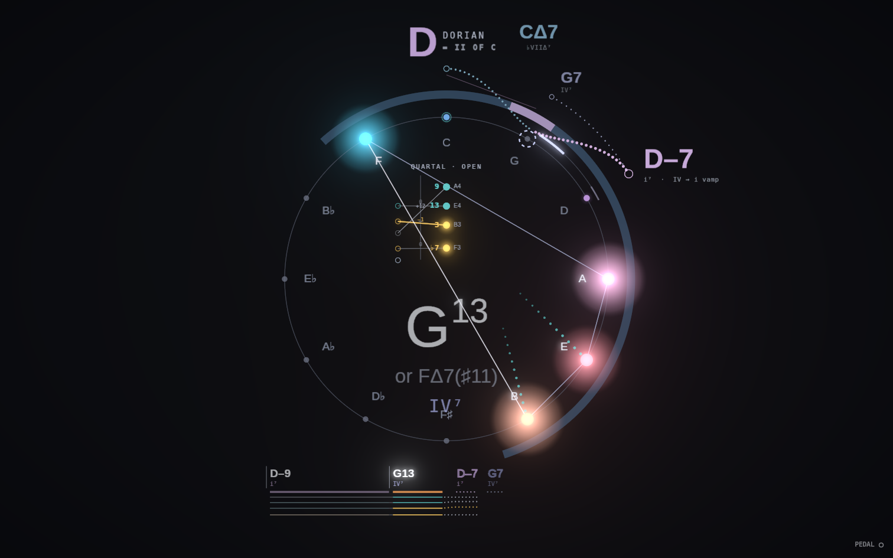
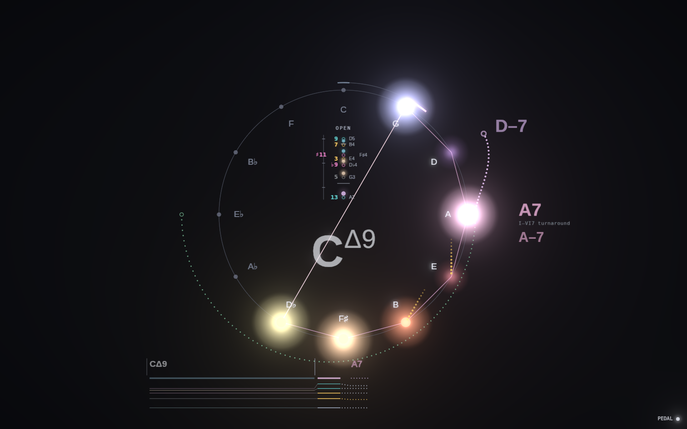
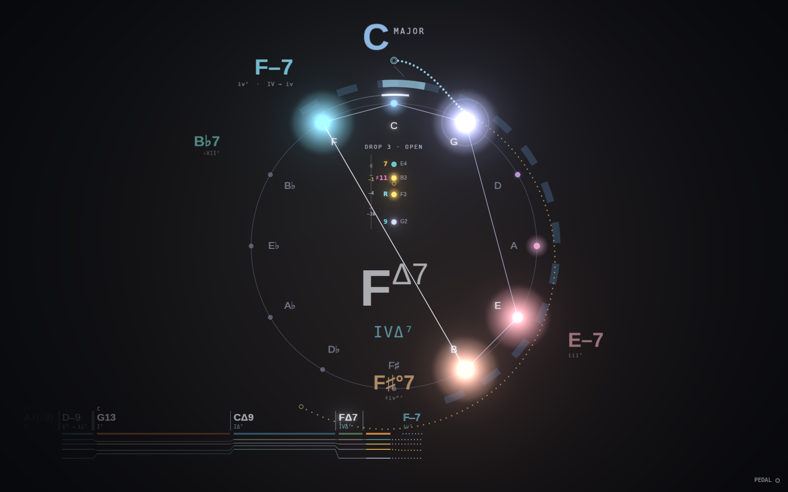
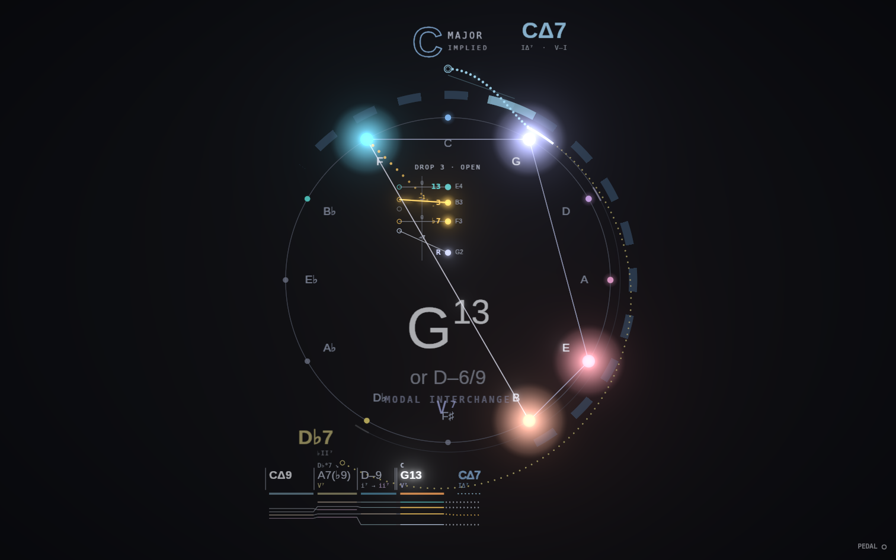

# Compass, round three

Ideas 1–5 from the design team's round-three proposal. Every new mark follows the ink = certainty taxonomy, and each new layer has its own toggle in the layer menu (all on by default).

## 1. Modal frame
When a vamp settles (about 3 s on a modal center with nothing breaking it), the key reads as the mode, e.g. **D DORIAN**, with a hollow caption **= II OF C** underneath. Center and prediction numerals now count from the same tonic (i⁷, IV⁷), so they agree. Predictions follow vamp rules (dorian i ↔ IV7, side-slips, ♭VII; mixolydian I7 ↔ ♭VII / IV / v–7). A ii–V, a maj7, or a cadence out of the vamp breaks the frame back to the parent key.

Try it: vamp D–7 to G7 for a few seconds.

## 2. Pedal & touch (layer: *Pedal & touch*)
Notes held only by the sustain pedal pool into a haze on their spoke instead of a crisp dot; half pedal gives a thinner wash, and lifting the pedal sends a damper sweep across the ring. In the voicing stack, disc size and brightness follow velocity, the soft pedal cools the colors, and a top voice played quieter than the inner voices gets an underline.

## 3. Hindsight relabel
The lead sheet re-reads the previous chord once the next one reveals what it was: a dim7 that resolves up a half step becomes a rootless 7♭9 (C♯°7 → D–7 relabels as A7(♭9)), and an FΔ7 that moves to G7 becomes a rootless D–9 (unless the bass sits low on F). The old name stays small with a ↘. At a key change the pivot chord shows both numerals (e.g. iii⁷ → ii⁷).

## 4. Tendency tails (layer: *Tendency tails*)
Guide tones and tensions that want to move get a dotted comet toward the note they resolve to in the predicted next chord (G13 → CΔ7: F leans to E). When you land it, the path fills in gold.

## 5. Hidden voices (layer: *Hidden voices*)
Under the lead sheet, a band traces each of the lowest five voices through time, colored by role on the current chord. Guide-tone steps are drawn gold, and a dotted continuation shows where each voice would go in the predicted chord.

