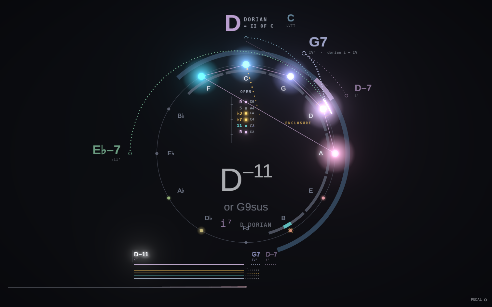
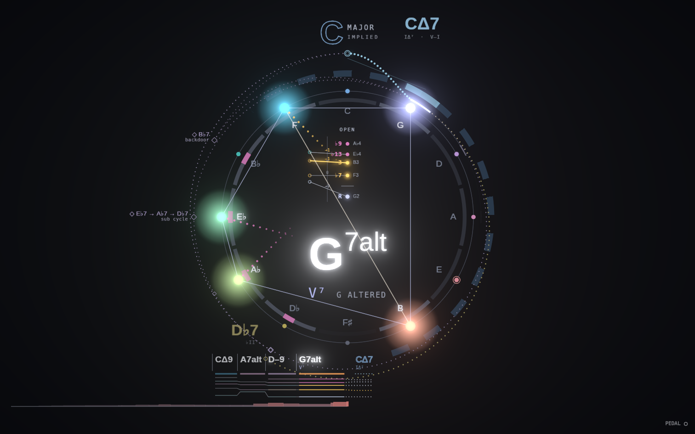
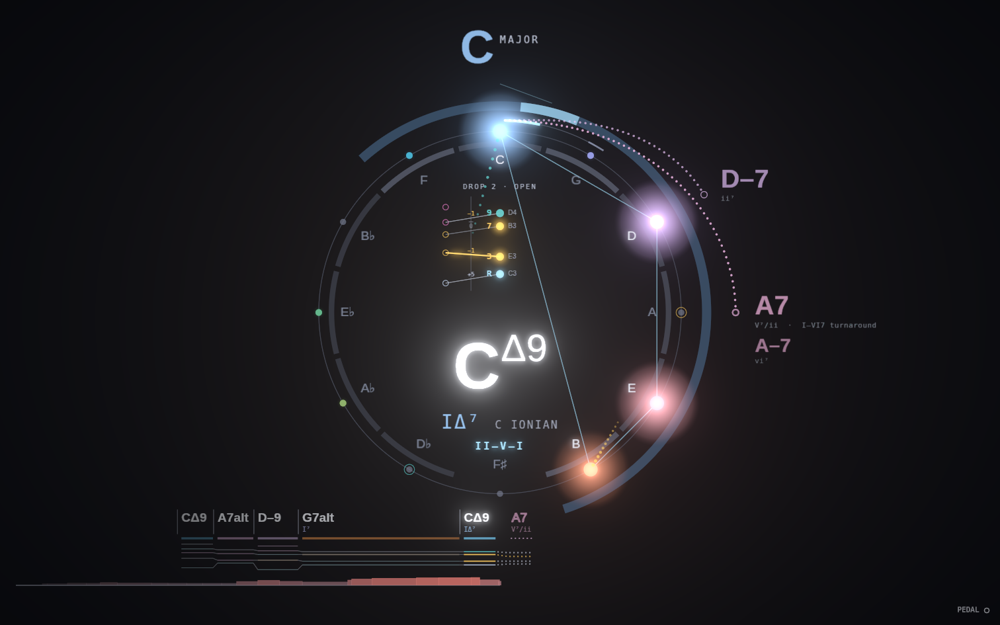

# Compass, round four

Ideas 6–8 from the design team's proposal. Each is its own layer in the layer menu (all on by default): *Scale & line*, *Reharm offers*, *Tension curve*.

## 6. Scale halo and line reading (layer: *Scale & line*)
The chord-scale glows as a faint band just inside the ring. In fifths order a diatonic mode is one seven-note sector. The scale's color tone is ticked teal (dorian ♮6, lydian ♯4) and alterations are ticked magenta (♭9 ♯9 ♯11 ♭13 on an altered dominant). The scale's name sits beside the numeral, e.g. "i⁷ D DORIAN".

How the scale is picked: mode frame first (D dorian on a So What vamp), then degree in the key (iii phrygian, vi aeolian, IV lydian), then what the chord actually contains. A dominant with ♭9 and the natural 13 gets half-whole, any ♯9/♭13 gets altered, a ♯11 gets lydian ♭7, and V⁷(♭9) in a minor key gets phrygian dominant.

Right-hand single notes above middle C are read as a line against the scale:
- A note inside the scale lights its segment of the band.
- A chromatic note gets a hollow ring on the band, so it reads as a deliberate approach.
- When two notes close in on a target from above and below (E, C♯ → D), a gold bracket and "ENCLOSURE" mark the target.

Try it: vamp D–7, then play E C♯ D on top.

## 7. Reharm offers (layer: *Reharm offers*)
When the next chord is clear, hollow violet diamonds show what you could play instead. Each draws its path on the circle between the key arc and the prediction orbit.
- On G7 → C: tritone sub (D♭7), backdoor (B♭7), and a back-cycled chain of subs (E♭7 → A♭7 → D♭7).
- On D–7 → G7: ii–subV (D♭7) and the backdoor ii–V (F–7 → B♭7).

They're ranked by how few semitones your current voicing would move, smoothest first. Offers are possible, not probable, so they're one violet and never take a root's hue like a prediction. A label that would collide with a prediction is left as a bare diamond. Modal vamps get no offers, because a dorian IV⁷ isn't asking to resolve.

A note on naming: the proposal called the E♭7 → A♭7 → D♭7 path "Coltrane". It's really a chain of dominants back-cycling into the tritone sub, so it's labeled "sub cycle". Coltrane changes (major thirds) would be a separate offer if wanted.

## 8. Tension curve (layer: *Tension curve*)
A slim ribbon at the very bottom scrolls with the lead sheet. Its height and heat (grey-blue at rest, coral at full pull) follow one tension number:
- The chord's quality (a triad rests; an altered dominant pulls hardest), plus each ♭9/♯9/♯11/♭13 on a dominant.
- Roughness: half steps and tritones among what sounds.
- Distance from the key: notes outside it, and how far the root sits round the circle of fifths.

The theory code is in `packages/theory/src/scales.ts`, `reharm.ts` and `tension.ts`, with tests in `test/round4.test.ts`.
