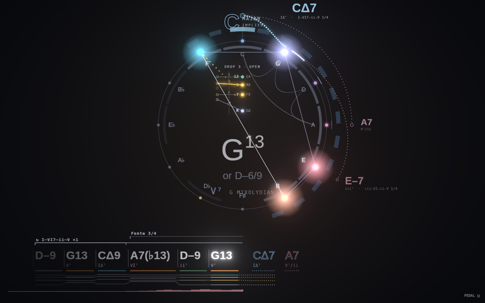
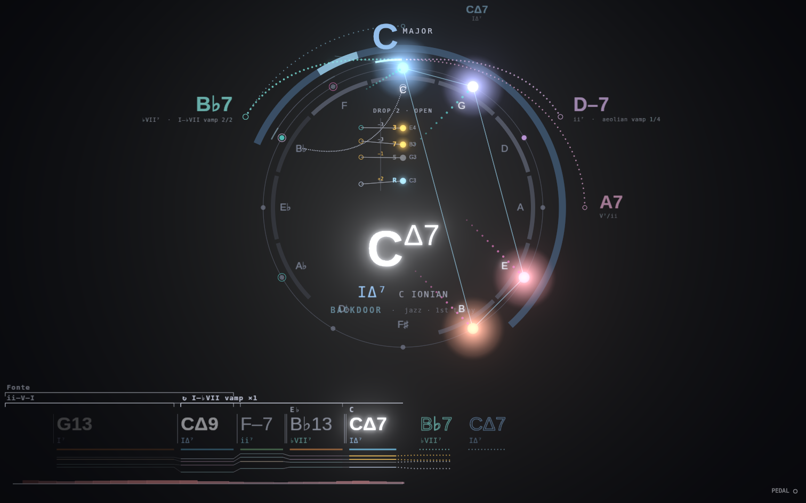
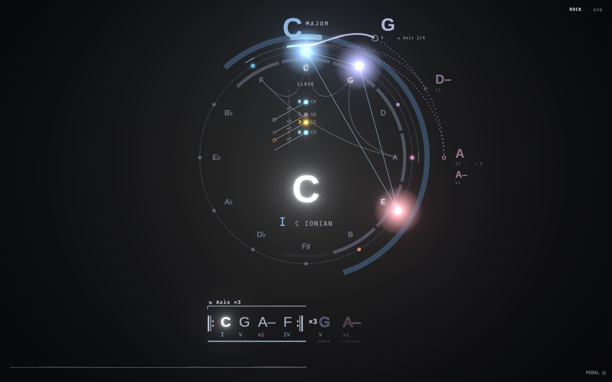
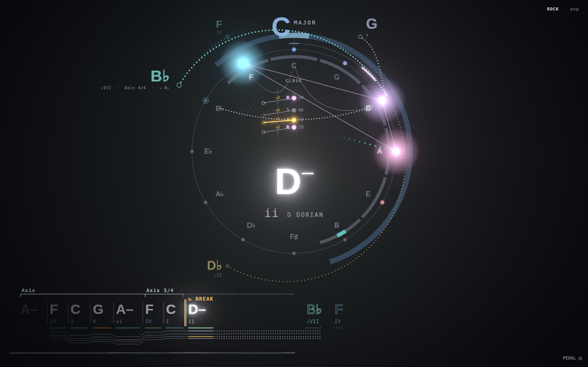
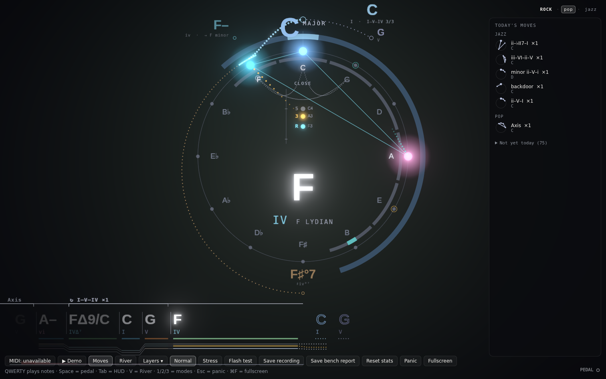

# Micro progressions

The compass now knows a library of named moves (ii–V–I, backdoor, IV–iv–I, the Axis, the Andalusian cadence, the blues turnaround and so on) and recognizes them in any key as you play. This builds the proposal's ideas 1–6. Each is its own layer in the layer menu, all on by default: *Move brackets*, *Loop lock*, *Move shape*, *Style lens*. Today's moves opens with **M** or the *Moves* button.

Also in this change, the lead sheet takes the bottom quarter of the window and the compass the top three quarters, so names and brackets read from across the room.

## The library
There are 81 moves across ten style families: jazz, pop, rock, gospel, blues, folk, latin, film, modal and classical. Each move is one line of data in `packages/theory/src/moves.ts`, written in roman numerals:

```ts
mv('jazz.backdoor', '(iv7) ♭VII7 I', { name: 'backdoor', kind: 'cadence', styles: ['jazz', 'gospel'] })
mv('pop.axis', 'I V vi IV', { name: 'Axis', kind: 'loop', styles: ['pop', 'rock'], alias: [[9, 'minor epic']] })
```

Parentheses mark an optional step. Lowercase is minor, `7` a dominant (or a minor 7th on a lowercase numeral), `Δ` major 7th, `ø` half-diminished, `°` diminished, `+` augmented. A *loop* matches from any chord in it; a *cadence* predicts its arrival and then lets go. A loop can go by another name when home is elsewhere in it: the Axis heard from vi is the minor epic.

The matcher (`match.ts`) walks back through the last 16 chords. It allows tritone subs and up to two detours, such as a passing diminished chord, a chromatic approach, an inserted ii–V or a secondary dominant. A move from the styles you're playing weighs a little more, never to the exclusion of others. The library is checked for duplicates, and every move is tested in four keys as triads, as 7ths, from every rotation and with a passing °7 inserted.

## 1. Move brackets (layer: *Move brackets*)
A thin bracket over the lead sheet names the move you're in. It is dotted while forming ("ii–V–I 2/3"), solid once complete, and grey if you leave it. A cadence nested in a bigger move gets a second row: the ii–V–I inside a I–VI–ii–V. Two-chord cadences (V–I, IV–I) get a landing badge but no bracket, since they're everywhere.



## 2. Predictions name the move
A prediction the library led carries its reason: "completes ii–V–I", "Axis 2/4", "↻ Axis". The library and the old rules are blended, so a single chord still gets the old predictions. When you land, the badge names the move, its style and how many times today: "BACKDOOR · jazz · 1st today".



## 3. Move shapes (layer: *Move shape*)
The move you're in is drawn faintly inside the ring as a path on the circle of fifths. Played steps are dotted finely, the next step is dotted and the rest is a whisper. A ii–V–I is a short hook, a tritone sub cuts straight across, and I–V–vi–IV is a small zig-zag.

## 4. Loop lock (layer: *Loop lock*)
When the same few chords come round twice, the lead sheet folds them into a repeat: ‖: C G A– F :‖ ×3, with the chord now sounding lit. The predictions show ↻. This works for loops the library doesn't know too ("loop ↻"). Breaking out unfolds the block and marks the spot with an amber double bar and "↻ BREAK".




## 5. Style lens (layer: *Style lens*)
Top right: the style families the last few bars draw from, the lead in capitals (ROCK · pop · jazz). Tap one to lean the predictions toward it; tap again to let go. The reading comes from texture (triads vs 7ths, dominant I and IV, borrowed chords, sus and diminished chords) plus the moves you've played.



## 6. Today's moves (M)
A side panel lists every move that landed this session, grouped by family. Each shows its shape on the circle, a count, and the keys you played it in. The rest of the library sits greyed underneath ("Not yet today") for ideas.

## Your own moves: the miner
```
npm run learn -- ~/Documents/"MIDI Visualizer"
npm run learn -- take.mid --verbose
```
Replays saved takes through the analyzer and prints:
- coverage: the share of chord events that sat inside a named move;
- the moves that landed;
- three- and four-chord runs the library doesn't name that came back at least twice in at least two keys, as numerals.

`--add` appends those patterns to `packages/theory/src/mine.ts` as your own moves (style "mine"). Rename them there, and the tests check they don't duplicate a library move.

## Not done
- Ideas 7–9 from the doc (practice target, reharm offers as moves, tension caps) are not built.
- The blues, minor and modal-vamp prediction rules are still code, not library entries. They fire from one or two chords, before any move has formed.
- On the built-in demo the miner reports 56% coverage. Most of the gap is the demo's bebop lines read as clusters, which is an analyzer question rather than a library one.
